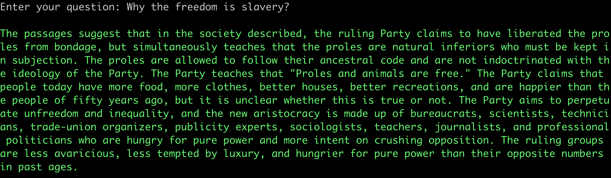
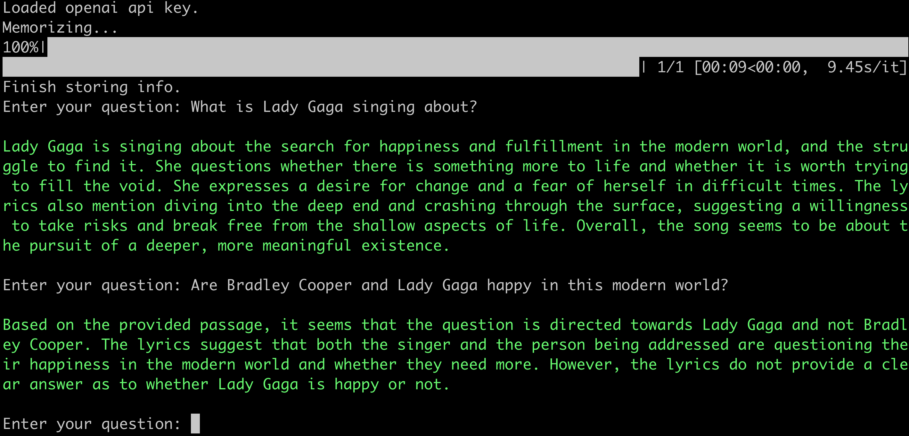

# My personal assistant

## Dependencies

Please execute the following command in the terminal to install the required dependencies:

Python>=3.12.3

```shell
pip install -r requirements.txt
```

## Configuration

Before running the application, you need to set up your environment variables:

1. Create a `.env` file in the root directory
2. Copy the contents from `.env-example`
3. Fill in your OpenAI API key if you want to use OpenAI embeddings

Example `.env` configuration:
```
USE_OPENAI_EMBEDDINGS=false
OPEN_API_TOKEN=your_api_key_here
```

## Usage

Download NLP toolkit

```shell
python3 ./install_nltk_data.py
```

### Local files

Remember to replace path to your file :)

```shell
python3 ./main.py /Users/awesome/testing.pdf
```



```shell
brew install ffmpeg
python3 ./main.py /Users/awesome/audio.mp3
```

### Web URLs

```shell
python3 ./main.py https://www.awesome-testing.com/training/chatgpt/
```

### Download and transcript YouTube videos

You need to login to YouTube at first use

```shell
python3 ./main.py https://www.youtube.com/watch?v=bo_efYhYU2A
```

